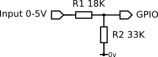

# Raspberry Pi - Useful Stuff

## Installation

Available distros for Raspberry Pi 3B+

* [Raspbian](https://www.raspberrypi.org/downloads/raspbian/)
* [ArchLinux](https://www.archlinux.org/download/) / [Guide](https://archlinuxarm.org/platforms/armv8/broadcom/raspberry-pi-3) / [Phortx's Guide](https://github.com/phortx/Raspberry-Pi-Setup-Guide)
* [Pi64](https://github.com/bamarni/pi64) 
* (Gentoo 64bit RPi3)[https://github.com/sakaki-/gentoo-on-rpi3-64bit]

### Images & Cards

**Mac / Windows**:

* [ApplePi Baker](https://www.tweaking4all.com/software/macosx-software/macosx-apple-pi-baker/) - Mac
* [PiBakery](https://www.pibakery.org/download.html) - Windows

**Mac EX4**

The root partition of an image or card is in Linux fileformat EXT4. To mount EXT4 with read/write permissions in Mac, use either:

*[ext4fuse](https://github.com/gerard/ext4fuse) (Free)
*[extfs-mac](https://www.paragon-software.com/home/extfs-mac/) (Paid)

**Raspberry Pi**:

[rpi-clone](https://github.com/billw2/rpi-clone) copies to any USB stick or SD card attached to the Pi. Regardless of the attached device, the filesystem will be copied if there is room.

```

# Install to bin

git clone https://github.com/billw2/rpi-clone.git 
cd rpi-clone
sudo cp rpi-clone rpi-clone-setup /usr/local/sbin

# View available disks

df -h

# Run

sudo rpi-clone sdX
```

**Linux**:

Copying:

```
df -h # List disks
sudo dd bs=1M if=/dev/sdX of=name-of-image.img status=progress
```

Mount Disk:

```
df -h # List disks
mkdir /media/Pi
sudo mount sdX /media/Pi

```

Mount Image:

```

# Find Offset - the second row "Start" value, ie. 94208

fdisk -lu raspi-stretch+of+ofnode-cross-compiler.img

# Do some maths - Offset * 512, ie. 94208  * 512 = 48234496

mkdir /tmp/rpi
mkdir /tmp/rpi/root

# Mount using the Offset value

sudo mount -o loop,offset=48234496,rw,sync raspbian-image.img /tmp/rpi/root

```

Shrink Card using [PiShrink](https://github.com/Drewsif/PiShrink):

```
# Installation:

wget https://raw.githubusercontent.com/Drewsif/PiShrink/master/pishrink.sh
chmod +x pishrink.sh
sudo mv pishrink.sh /usr/local/bin

# Run

sudo pishrink.sh [-s] imagefile.img [newimagefile.img]
```

## Spring Cleaning


**Update all**:

```zsh
# Update all
sudo apt-get update
sudo apt-get -y upgrade
sudo rpi-update

# Update raspi-config
sudo raspi-config # and select Update
```

**Clear up**:

```zsh
# Remove package
sudo apt-get purge -y wolfram-engine

# Cleanup retrived package files
sudo apt-get clean

# Remove extra packages installed
sudo apt-get autoremove 
```

**Analyse**:

```zsh
# Bootup speeds
systemd-analyze blame 

# List of packages by size
dpkg-query -Wf '${Installed-Size}\t${Package}\n' | sort -n 
```

## Headless

Methods for remotely working with the Pi with no keyboard, mouse or monitor attached - aka "headless".

### SSH

**SSH**

Three methods for enabling SSH:

* Create blank `ssh` file in root partition of newly installed card (the EXT4 partition)
* Use a keyboard to enable SSH via `sudo raspi-config`
* Use a keyboard to install `sudo apt install openssh-server`

Where should I SSH to? Ordinarily `pi@raspberrypi.local`, otherwise:

```
# From the Pi

whoami # ie. "autr"
hostname # ie. "raspbian-pi"

# From the Client

ssh autr@raspbian-pi.local

```

**SSHFS - Mac**:

You can work with the Pi Filesystem without SFTP using `sshfs`:

```zsh

# From the Pi

sudo apt-get install netatalk

# From the Mac

brew install sshfs
sshfs pi@raspberrypi.local:/home /Volumes/Pi
open /Volumes/Pi

```

**SMB - Linux**:

Another method to work with the Pi filesystem (or virtual machines) is `samba`:

```

# From the Pi

sudo apt-get install samba samba-common-bin
sudo nano /etc/samba/smb.conf

# Add this:

[debian]
path = /home/pi
read only = no
guest ok = no

# Set password

sudo smbpasswd -a pi

# Restart server

sudo /etc/init.d/smbd restart

# From the Client

smb://username@machine.local

```

**Remote Desktop**:

The easiest method to set up remote desktop is to use RealVNC Viewer:

* On the Pi, enable VNC via `sudo raspi-config` to begin installation
* On the Client, install [RealVNC Viewer](https://www.realvnc.com/en/connect/download/viewer/)

Without an HDMI connection to the Pi the resolution may be too small, but setting resolution via GUI will break automatic SD / HDMI switching. A safer alternative is to edit the `config.txt`:

```
sudo nano /boot/config.txt

# Set a usable resolution

framebuffer_width=1440 # 2 x PAL width, 720px
framebuffer_height=1152 # 2 x PAL height, 576px

# Keep GUI resolution options like this

# hdmi_force_hotplug=1
# hdmi_group=2
# hdmi_mode=4
```

## Utilities

### Useful Commands

**Run on Startup**:

```zsh

# When terminal session is loaded:

sudo nano /etc/rc.local

# When GUI is loaded (Desktop only):

sudo nano /etc/xdg/lxsession/LXDE-pi/autostart
# @sudo /home/pi/myscript.sh etc...

```

**Folder Size**
```
du -sh /home/pi

# Or Install:

sudo apt-get install ncdu
```

**Copy over SSH**

Can be dangerous / recursive if Symlinks are present:

```
scp -r pi@raspberrypi.local:~/MyFolder .
```

**Rsync over SSH**

Safer method that will copy Symlinks only:

```
rsync -avz -e ssh pi@raspberrypi.local:~/MyFolder .
```

**Unpack TAR**:

```
tar -xvzf your-file.tar.gz
```

**Make Executable**:

```
chmod +x ./pi/scripts/*
```

**Get Package Version**:

```
dpkg -l openssl
```

**Install Package @ Version**:

```
sudo apt-get install openssl=1.0.2
```

  

## GPIO


**Permissions**

Fix GPIO pin permission errors for OF / Processing;

```zsh
sudo adduser pi gpio
```

**What's What**


**Model 3B**:


**3.3V Logic!**

* Pi uses 3.3v logic on its board, not 5v like Arduino 
* Connected components should use a voltage divider (two resistors).
* [RPi Circuits](https://elinux.org/RPi_GPIO_Interface_Circuits)




## OpenFrameworks

### Cross-Compiler Guide

[OpenFrameworks 0.10.1 for Raspbian Stretch Armv6 Guide](of-cross-compile-guide.md)


## Processing for Pi

* [Processing for Pi](https://pi.processing.org/download/)
* Bash install script is broken, so install manually:

```
wget https://github.com/processing/processing/releases/download/processing-0265-3.4/processing-3.4-linux-armv6hf.tgz
tar -xvzf processing-3.4-linux-armv6hf.tgz
./processing-3.4/install.sh
```

* Use video via [GL Video](https://github.com/gohai/processing-glvideo)
* It's afest to use 720p videos , as 1080p is unstable


## Scripts

**playseries.sh**

Plays and loops videos within a folder

Install omxplayer

```zsh
sudo apt install omxplayer
```

Move to bin 

```zsh
sudo mv playseries.sh /usr/local/bin
```

Usage

```zsh
playseries [hdmi/local/both/alsa] [0,90,180,270] /media/usb/videos
```

**ultrasonic_osc.py**

Sends incoming Ultrasonic sensor from pins 11 and 12 to OSC destination `/Ultrasonic` on port 7000

**ultrasonic_listener.py**

Double-check port 7000 messages are being received

**processing_videoplayer.pde**

* Processing sketch to playback two video with an ultrasonic sensor
* Listens to port 7000 for `/Ultrasonic`
* Videos must be available in `~/Videos` or `/media/USB`

**update-upgrade.sh**

Apt-get upgrade install everything

